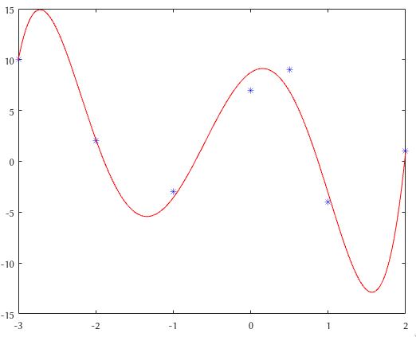

# Least Squares

Figure 1:
* in_x = [-3, -2, -1, 0, 1, 2];
* in_y = [10, 2, -3, 7, -4, 1];

Figure 2:
* in_x = [-3, -2, -1, 0, 1, 2, 0.5];
* in_y = [10, 2, -3, 7, -4, 1, 9];

Figure 3:
* in_x = [-3, -2, -1, 0, 1, 2];
* in_y = [1, 1, 1, 1, 1, 2];

Figure 4:
* in_x = [-3, -2, -1, 0, 1, 2];
* in_y = [1, 1, 1, 2, 1, 1];

Figure 5:
* random, m = 15

Figure 6:
* random, m = 30
* red is my implementation
* green is polyfit

Figure 7:
* random, m = 14
* red is my implementation
* green is polyfit

