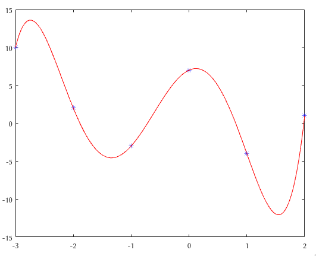

# Метод наименьших квадратов

Для всех примеров `n = 6`, однако код будет работать корректно для всех `n > 0`
(при условии, что `m >= n`, где `m` - количество _уникальных_ узлов интерполяции `x`).

## Примеры

* in_x = [-3, -2, -1, 0, 1, 2];
* in_y = [10, 2, -3, 7, -4, 1];

---

* in_x = [-3, -2, -1, 0, 1, 2, 0.5];
* in_y = [10, 2, -3, 7, -4, 1, 9];

---

* in_x = [-3, -2, -1, 0, 1, 2];
* in_y = [1, 1, 1, 1, 1, 2];

---

* in_x = [-3, -2, -1, 0, 1, 2];
* in_y = [1, 1, 1, 2, 1, 1];

---

* Random, m = 15

---

* Random, m = 30
* Красная линия -- данная реализация
* Зелёная линия -- polyfit

---

* Random, m = 14
* Красная линия -- данная реализация
* Зелёная линия -- polyfit

## Полезные ссылки
1. [Записная книжка профессора Утешева](vmath.ru)

